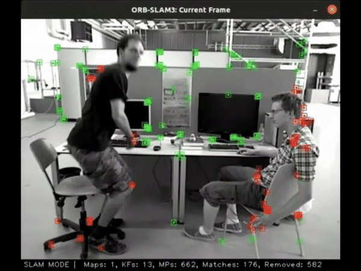

# Masked ORB-SLAM3

## Project Overview

This project is for DICTA 2024 Paper:

- Zhiheng Tang (CSIRO), Chuong Nguyen (CSIRO), Sundaram Muthu (CSIRO), “Dynamic SLAM using video object segmentation: A low-cost setup for mobile robots,” DICTA 2024, Perth, Australia.

SLAM approaches, whether traditional, deep learning-based, or incorporating radiance field representations, face a common challenge in handling dynamic scenes due to their assumption of a static environment.While some methods have attempted dynamic SLAM, they often rely on single-object semantic segmentation, which is effective only for known object classes with prior knowledge of their static or dynamic nature. To address this limitation, we propose incorporating video object segmentation methods into our approach, which combines segmentation and tracking.

To demonstrate the effectiveness of our method, we conduct an experimental study using the TUM-RGBD dataset and our RoverLab dynamic SLAM dataset, showcasing an enhancement in SLAM accuracy.

## Features

### Dataset

The dataset we used is an augmented TUM RGB-D dataset and includes the following components:

- **rgb/**: Color images in PNG format (3 channels).
- **depth/**: Aligned depth images corresponding to the color images, in PNG format (1 channel, distances in meters scaled by a factor of 1000).
- **mask/**: Mask images corresponding to the color images, in PNG format (1 channel, values 0 or 255).
- **rgb.txt**: Timestamps and file paths for the color images.
- **depth.txt**: Timestamps and file paths for the depth images.
- **mask.txt**: Timestamps and file paths for the mask images.
- **groundtruth.txt**: Ground truth trajectory computed by Direct LiDAR Odometry (DLO). Stored as timestamped translation vectors and unit quaternions (format: timestamp tx ty tz qx qy qz qw).

The mask/ and mask.txt is generated by our script as an augmentation for TUM dataset.

### Updated File

The following files are modified to support the Masked ORB-SLAM 3.

Monocular Mode
- Examples/Monocular/mono_tum.cc (Original)
- Examples/Monocular/mono_tum_mask.cc (Masked)
- Examples/Monocular/TUM3.yaml (For TUM dataset)
- Examples/Monocular/d435i.yaml (For our dataset)

RGB-D Mode
- Examples/RGB-D/rgbd_tum.cc (Original)
- Examples/RGB-D/rgbd_tum_mask.cc (Masked)
- Examples/RGB-D/TUM3.yaml (For TUM dataset)
- Examples/RGB-D/d435i.yaml (For our dataset)

Integrate Masking in ORB-SLAM Internal Behavior
- src/Frame.cc
- src/Tracking.cc
- src/System.cc

Color the Retained and Removed Features

- src/FrameDrawer.cc

Specify Compile Target
- CMakeLists.txt

### How to Run

Remember to modify the dataset path accordingly.

Monocular without Mask
~~~
./Examples/Monocular/mono_tum Vocabulary/ORBvoc.txt Examples/Monocular/TUM3.yaml ~/Downloads/rgbd_dataset_freiburg3_walking_static
~~~

Monocular with Mask

~~~
./Examples/Monocular/mono_tum_mask Vocabulary/ORBvoc.txt Examples/Monocular/TUM3.yaml ~/Downloads/rgbd_dataset_freiburg3_walking_static
~~~

RGB-D without Mask

~~~
./Examples/RGB-D/rgbd_tum Vocabulary/ORBvoc.txt Examples/RGB-D/TUM3.yaml ~/Downloads/rgbd_dataset_freiburg3_walking_static
~~~

RGB-D with Mask

~~~
./Examples/RGB-D/rgbd_tum_mask Vocabulary/ORBvoc.txt Examples/RGB-D/TUM3.yaml ~/Downloads/rgbd_dataset_freiburg3_walking_static
~~~

## Acknowledgement

This repository investigates the implementation of masking in ORB-SLAM, with reference to the project by the University of Michigan (https://gitlab.eecs.umich.edu/v_slam/orb-slam_dynamic), as well as to ORB-SLAM3 (https://github.com/UZ-SLAMLab/ORB_SLAM3) and DynaSLAM (https://github.com/BertaBescos/DynaSLAM).
